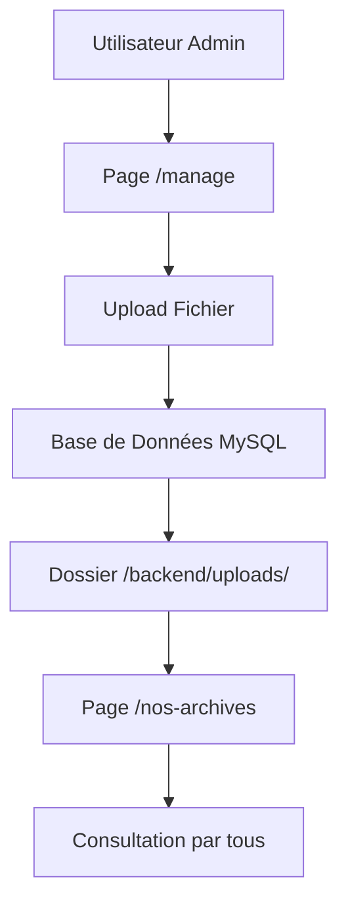

# 📁 Architecture de Gestion des Fichiers - Alliance Courtage

## 🎯 Séparation des Fonctionnalités

L'application dispose maintenant de **deux pages distinctes** pour la gestion des fichiers :

### 1. 📤 Page `/manage` - Gestion des Fichiers
**URL** : `http://localhost:5174/#manage`

**Fonctionnalités** :
- ✅ **Upload de fichiers** avec métadonnées complètes
- ✅ **Gestion des fichiers** (suppression, modification)
- ✅ **Filtres et recherche** avancés
- ✅ **Interface d'administration** complète
- ✅ **Feedback utilisateur** en temps réel

**Accès** : Réservé aux utilisateurs connectés (admin recommandé)

### 2. 📂 Page `/nos-archives` - Consultation des Archives
**URL** : `http://localhost:5174/#nos-archives`

**Fonctionnalités** :
- ✅ **Affichage organisé** par catégories
- ✅ **Recherche et filtres** pour consultation
- ✅ **Téléchargement** des fichiers
- ✅ **Interface utilisateur** simplifiée
- ✅ **Organisation visuelle** en dossiers

**Accès** : Tous les utilisateurs connectés

## 🔄 Workflow de Gestion des Fichiers



## 📋 Structure des Composants

### Frontend (React/TypeScript)
```
src/
├── FileManagePage.tsx      # Page d'upload et gestion
├── NosArchivesPage.tsx     # Page de consultation
├── App.tsx                 # Routage et navigation
└── api.js                  # API calls
```

### Backend (Node.js/Express)
```
backend/
├── routes/archives.js       # API CRUD des fichiers
├── uploads/                # Stockage physique
├── config/database.js      # Connexion MySQL
└── server.js               # Serveur principal
```

## 🎨 Interface Utilisateur

### Page `/manage` - Gestion
- **Formulaire d'upload** complet avec validation
- **Liste des fichiers** avec actions (supprimer, télécharger)
- **Filtres avancés** (catégorie, année, recherche)
- **Feedback visuel** (loading, succès, erreur)

### Page `/nos-archives` - Consultation
- **Organisation par catégories** (dossiers visuels)
- **Recherche simplifiée** pour consultation
- **Boutons de téléchargement** uniquement
- **Interface épurée** pour la consultation

## 🔐 Sécurité et Permissions

### Upload (`/manage`)
- ✅ **Authentification JWT** requise
- ✅ **Validation des types** de fichiers
- ✅ **Limitation de taille** (10MB)
- ✅ **Noms sécurisés** (timestamp + random)
- ✅ **Réservé aux admins** (recommandé)

### Consultation (`/nos-archives`)
- ✅ **Authentification JWT** requise
- ✅ **Accès en lecture seule**
- ✅ **Tous les utilisateurs** connectés
- ✅ **Pas de modification** possible

## 📊 Types de Fichiers Supportés

| Type | Extensions | Icône | Taille Max |
|------|------------|-------|------------|
| PDF | `.pdf` | 📄 | 10MB |
| Word | `.doc`, `.docx` | 📝 | 10MB |
| Excel | `.xls`, `.xlsx` | 📊 | 10MB |
| PowerPoint | `.ppt`, `.pptx` | 📊 | 10MB |
| Images | `.jpg`, `.jpeg`, `.png`, `.gif` | 🖼️ | 10MB |
| Texte | `.txt` | 📁 | 10MB |

## 🗂️ Catégories Disponibles

- **Actualités** - Newsletters, communiqués
- **Produits** - Catalogues, guides produits
- **Rapports** - Rapports annuels, bilans
- **Formation** - Documents de formation
- **Réglementaire** - Textes réglementaires
- **Marketing** - Supports marketing
- **Administratif** - Documents administratifs

## 🚀 Comment Utiliser

### Pour Uploader des Fichiers :
1. Connectez-vous avec un compte admin
2. Naviguez vers "Gestion des fichiers" (`/manage`)
3. Remplissez le formulaire d'upload
4. Cliquez sur "Uploader le fichier"

### Pour Consulter les Archives :
1. Connectez-vous avec n'importe quel compte
2. Naviguez vers "Nos Archives" (`/nos-archives`)
3. Utilisez les filtres pour rechercher
4. Cliquez sur "Télécharger" pour accéder au fichier

## 🔧 Configuration Technique

### Base de Données MySQL
```sql
CREATE TABLE archives (
  id INT PRIMARY KEY AUTO_INCREMENT,
  title VARCHAR(255) NOT NULL,
  description TEXT,
  file_path VARCHAR(500) NOT NULL,
  file_size INT,
  file_type VARCHAR(50),
  category VARCHAR(100),
  year INT,
  uploaded_by INT,
  created_at TIMESTAMP DEFAULT CURRENT_TIMESTAMP
);
```

### API Endpoints
- `GET /api/archives` - Liste des fichiers
- `POST /api/archives` - Upload d'un fichier
- `DELETE /api/archives/:id` - Suppression d'un fichier
- `GET /api/archives/:id` - Détails d'un fichier

## 📈 Avantages de cette Architecture

1. **Séparation des responsabilités** - Upload vs Consultation
2. **Sécurité renforcée** - Accès différencié par rôle
3. **Interface adaptée** - UX optimisée pour chaque usage
4. **Maintenance facilitée** - Code modulaire et organisé
5. **Évolutivité** - Facile d'ajouter de nouvelles fonctionnalités

---

**L'architecture est maintenant optimisée avec une séparation claire entre gestion et consultation !** 🎉


